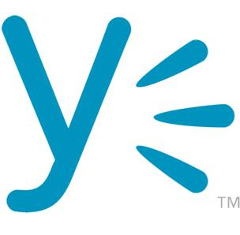

<!SLIDE bullets incremental>
# Congratulations!
* You've completed the RailsBridge Curriculum!

<!SLIDE bullets incremental>
# Thank you thank you thank you(s)!
* Thank you to you guys for coming!
* A big thank you to our volunteers!
* A huge thank you to our awesome sponsor!

<!SLIDE bullets>
# What did we learn?
* Ruby as a language
* Rails as a framework
* MVC design pattern

<!SLIDE bullets>
# Moving forward...!
* Hopefully we managed to demystify a few things
* Do not be discouraged!
* Learn enthusiastically!
* Get involved!

<!SLIDE bullets>
# Resources:
* http://installfest.railsbridge.org/workshop/resources
* http://pinterest.com/pvnrtmol/ruby-and-rails-resources/
* http://pinterest.com/eanakashima/learn-the-front-end/
* #RailsBridge, #Rails IRC channel
* DevChix E-mail list http://www.devchix.com/

<!SLIDE bullets>
# Anonymous Feedback
* http://bit.ly/workshop_survey

<!SLIDE bullets incremental>
# After-party
* Time to celebrate!